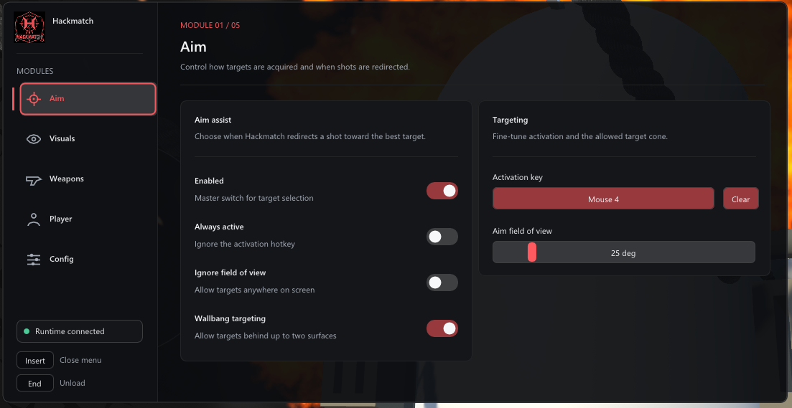

# Hackmatch: Redmatch 2 Cheat

[](#requirements)
[](CMakeLists.txt)
[](https://github.com/fluffysnaff/hackmatch/releases/latest)
[](LICENSE)

<p align="center"></p>

## Get Started

### [Download the Latest Release](https://github.com/fluffysnaff/hackmatch/releases/latest)

Download and extract the latest release, then run:

```bat
install.bat
```

> After installing Hackmatch, start Redmatch 2 and press `Insert` to open/close the menu.

See the [installation guide](docs/installation.md) for custom game paths, manual installation, what the script does, and solutions to common errors.

## Overview

Hackmatch is an open-source, Windows-only **Redmatch2 hack** written in C++20.

**-> See the [whole menu](images/README.md).**

## Contents

- [Redmatch 2 mod features](#features)
- [Technology](#technology)
- [Source build requirements](#requirements)
- [Build from source](#building)
- [Hotkeys and controls](#controls)
- [Documentation](#documentation)
- [FAQ](#faq)
- [Project Notice](#project)

<a id="features"></a>

## Redmatch 2 Mod Features

| Module | Current options |
| --- | --- |
| Aimbot | Configurable activation, camera-aware FOV, team filtering, target points, wall check, ignore shielded |
| Visuals | Full/corner boxes, names, distance, snaplines, offscreen arrows, target markers |
| Weapons | No spread, infinite ammo, fast reload, no camera shake, and rapid fire |
| Player | Auto sprint, custom player speed, gravity controls, camera FOV, movement graph, and disable own spawn protection |
| Config | Streamproof capture control, named profiles, config sharing, configurable hotkeys, menu opacity, 36 built-in themes, custom theme editor, and project/version details |

Themes and settings are saved with profiles in `%APPDATA%\Hackmatch\profiles`.

<a id="technology"></a>

## Technology

Hackmatch is a native C++20 DLL that works with Redmatch 2's IL2CPP runtime. It uses MinHook for hook lifecycle, DirectX 11 for rendering, Dear ImGui for the menu, and CMake with Ninja for reproducible builds.

<a id="requirements"></a>

## Source Build Requirements

- Windows 10(*not tested*) or Windows 11
- Redmatch 2 on Steam
- Visual Studio 2022 C++ Build Tools
- CMake 3.24 or newer
- Ninja

<a id="building"></a>

## Build from Source

Install the requirements above, then clone and build the repository:

```bat
git clone https://github.com/fluffysnaff/hackmatch.git
cd hackmatch
scripts\build_release.bat
```

The release DLL is written to `build-release\hackmatch.dll`. To build and install in one step:

```bat
build_and_install.bat
build_and_install.bat "C:\Program Files (x86)\Steam\steamapps\common\Redmatch 2"
```

See the [installation guide](docs/installation.md) for full instructions and troubleshooting.

At startup, Hackmatch compares Steam's installed build ID with the build recorded in `game_offsets.h`. A mismatch is reported in the menu and console but does not prevent startup. 

<a id="controls"></a>

## Hotkeys and Controls

| Key | Action |
| --- | --- |
| `Insert` | Toggle the menu (configurable) |
| `End` | Unload, restore modified state and remove hooks (configurable) |

<a id="documentation"></a>

## Documentation

- [Aim and raycasting](docs/aim-and-raycasting.md)
- [Capture visibility and Streamproof](docs/capture.md)
- [Compact game reverse-engineering notes](docs/game-re/README.md)
- [Installation and troubleshooting](docs/installation.md)
- [Movement](docs/movement.md)
- [Scripts](docs/scripts.md)
- [Updating game bindings](docs/updating-bindings.md)
- [Contributing and UI previews](CONTRIBUTING.md)

<a id="faq"></a>

## FAQ

### What is Hackmatch?

Hackmatch is a native Redmatch 2 hack for Windows. It provides aimbot, ESP, weapon, player, appearance, profile, and hotkey settings in an in-game ImGui menu.

### How do I install Hackmatch?

Download and extract the latest release(optionally **building from the source is recommended**), then run `install.bat`. It finds the Redmatch 2 Steam installation and installs the packaged DLL as `Redmatch 2_Data\enforcer.dll`. Source builds can use `build_and_install.bat` instead.

### Does Hackmatch support every Redmatch 2 version?

IL2CPP bindings can change when Redmatch 2 updates. Hackmatch compares the installed Steam build with its supported build and displays a warning when they do not match. See [Updating game bindings](docs/updating-bindings.md) for the verification process.

### Where are Hackmatch profiles stored?

Profiles, themes, hotkeys, and other settings are stored in `%APPDATA%\Hackmatch\profiles`. Configurations can also be shared using **Copy current config** and **Paste config** in the Config module.

<a id="project"></a>

## Project Notice

**Hackmatch is an independent educational project, not affiliated with Redmatch 2. Use it only where you have permission and understand the game's rules. Licensed under [GPL-3.0](LICENSE); third-party notices are in [NOTICE](NOTICE).**

## Star History

<a href="https://www.star-history.com/?type=date&repos=fluffysnaff%2Fhackmatch">
 <picture>
   <source media="(prefers-color-scheme: dark)" srcset="https://api.star-history.com/chart?repos=fluffysnaff/hackmatch&type=date&theme=dark&legend=top-left&sealed_token=6XwskM4RBkrUZ2d0yKXhYPHa2WuCwIZFuzy0bCD4UQnOY_MmxxwmwdLFrt6N4pqcTISHbz5W5Vw-Vt61Q1mR4An_7pGGs4CG6jlQLVdWe28hwefH0ljHEUsicJLnE3X0AZ6bfzt8lIlJTpIbLJbxU_XaC-K0AbApQX5qR_ma81QjSNaf7SOIdgnnDfpf" />
   <source media="(prefers-color-scheme: light)" srcset="https://api.star-history.com/chart?repos=fluffysnaff/hackmatch&type=date&legend=top-left&sealed_token=6XwskM4RBkrUZ2d0yKXhYPHa2WuCwIZFuzy0bCD4UQnOY_MmxxwmwdLFrt6N4pqcTISHbz5W5Vw-Vt61Q1mR4An_7pGGs4CG6jlQLVdWe28hwefH0ljHEUsicJLnE3X0AZ6bfzt8lIlJTpIbLJbxU_XaC-K0AbApQX5qR_ma81QjSNaf7SOIdgnnDfpf" />
   
 </picture>
</a>
