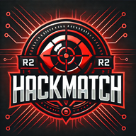
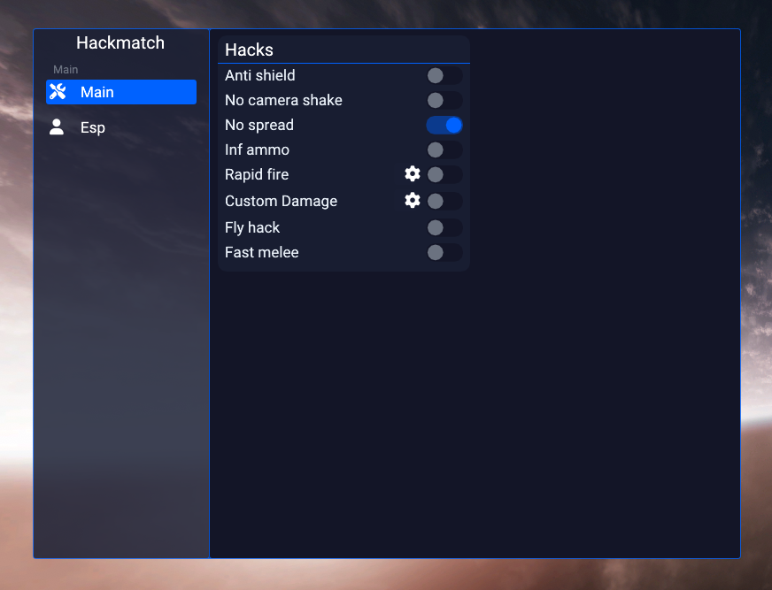

# 🔥 Hackmatch
Hackmatch is a simple cheat I made for Redmatch 2 to learn IL2CPP and because of lack of good cheats for RM2 at that time. It is using the IL2CPP dumper's SDK + 
renamed variables names from an older RM2 version

<p align="center">
  
</p>

## 🚀 Features
### 🎯 Main:
- **Anti shield**: Bypass shield mechanics.
- **No cam shake**: Disable camera shake effects.
- **No spread**: Eliminate weapon bullet spread.
- **Infinite ammo**: Unlimited ammunition.
- **Rapid fire**: High fire rate (use with caution, can be risky).
- **Custom damage**: Set custom damage values.
- **Fly hack**: Enable flying capabilities.
- **Fast melee**: Speed up melee attacks.

### 👁️ ESP:
- **Box ESP**: Visual boxes around targets.
- **Nameplates**: Display player names.



## 🤝 Contributions
Contributions are welcome! This project is no longer actively maintained and community contributions are required to keep it alive. Feel free to submit a pull request wether it's cleaning up the code, fixing bugs, updating the SDK or adding new features.

## 🛠️ How to Use
Hackmatch is a C++ project designed to work on Windows using Visual Studio.

### ⚙️ Build Instructions
1. **Clone the Repository**:
   Open your terminal or Git Bash, and clone the repository:
   ```bash
   git clone https://github.com/fluffysnaff/hackmatch.git
   ```
2. **Open the Project in Visual Studio**:
    - Launch Visual Studio
    - Open the .sln file located in the cloned repository
    - Build with x64-Release
    
### 🔄 Updating instructions
1. Use IL2CPPDumper to get the `il2cpp.h` file
2. Backup the old `il2cpp.h` file located at `./il2cpp/il2cpp.h`
3. Add the new dumped .h file
4. Copy the first 3 lines from old to new(makes it possible to use the il2cpp sdk)
5. Rename conflicting variable names(for example `struct STDIN;` to `struct aaaa;`)
6. Rename needed variables(for example `float _____11;` to `float bulletSpread;`)
7. Done

### 👏 Credits
- Perfare - [Il2CppDumper](https://github.com/Perfare/Il2CppDumper)
- cheatdeveloper73 - [Valuable variable names and ideas for the features](https://github.com/cheatdeveloper73/redmatch-cheat)